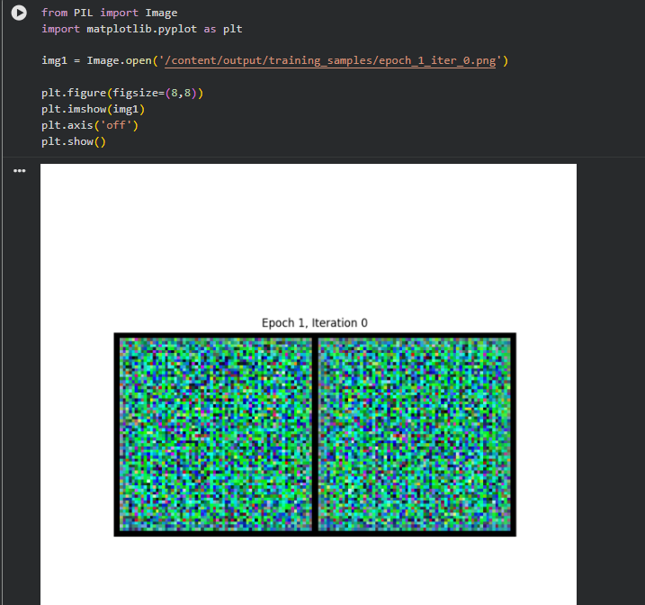
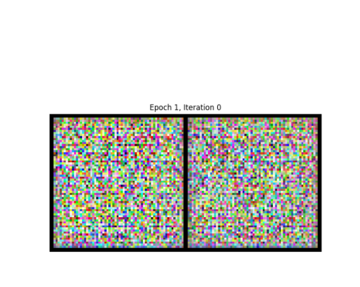
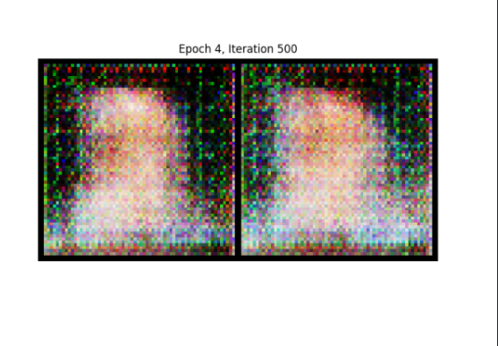
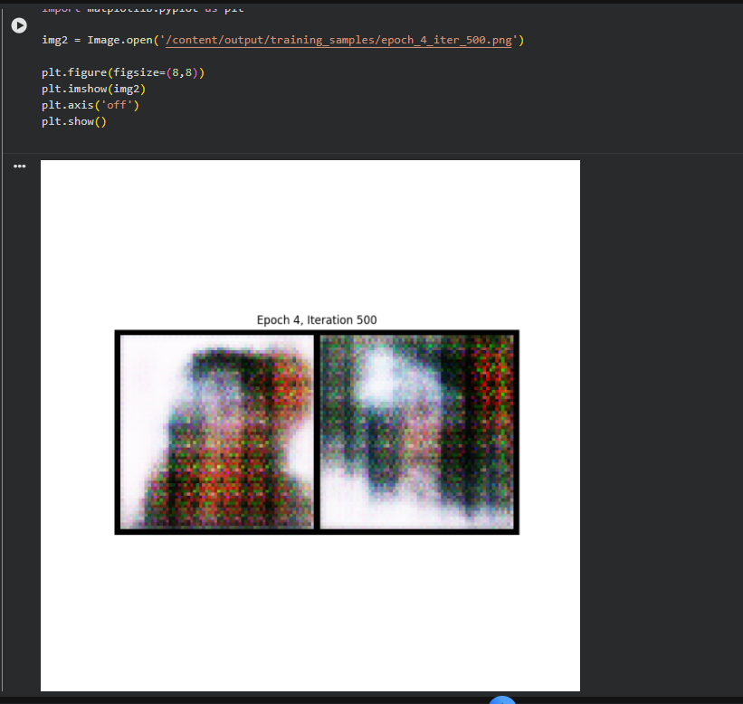

# Text-to-Face Image Generation using Conditional GANs

## Project Overview

This project implements a Conditional Generative Adversarial Network (cGAN) for generating Indian human face images from textual descriptions. The system combines Natural Language Processing (NLP) and Computer Vision techniques to synthesize facial images based on semantic text prompts.

The model uses transformer-based text embeddings along with a GAN architecture to learn relationships between textual facial descriptions and corresponding face images.

---

## Features

- Text-conditioned image generation
- Conditional GAN (cGAN) architecture
- Transformer-based text embeddings using BERT
- GPU-accelerated training using PyTorch
- Automated sample image generation during training
- Prompt-based facial image synthesis
- Training progress visualization
- Adversarial learning pipeline implementation

---

## Technologies Used

- Python
- PyTorch
- Hugging Face Transformers
- GANs (Generative Adversarial Networks)
- NLP
- Computer Vision
- Matplotlib
- Pandas
- PIL
- CUDA GPU Training

---

## Project Architecture

### Workflow

Text Prompt  
↓  
Tokenizer  
↓  
BERT Embedding  
↓  
Generator + Random Noise  
↓  
Generated Face Image  
↓  
Discriminator Validation  
↓  
Adversarial Training

---

## Dataset

The project uses a facial dataset stored in Parquet format containing:

- Face images
- Corresponding facial attribute descriptions

Example prompt:

```text
"A adult male, with oval face shape, black hair, thick eyebrows, and medium lips."
```

Due to dataset size limitations, the dataset is not included in this repository.

---

## Model Components

### Generator
- Takes random noise and text embeddings as input
- Generates synthetic facial images
- Uses transposed convolution layers for image synthesis

### Discriminator
- Determines whether generated images are real or fake
- Validates consistency between generated image and text prompt

### Text Embedding Module
- Uses `dslim/bert-base-NER`
- Extracts semantic embeddings from textual prompts

---

## Training Details

- Framework: PyTorch
- Image Resolution: 64×64
- Optimizer: Adam
- Loss Function: Binary Cross Entropy Loss (BCELoss)
- GPU Training: Enabled using CUDA
- Training Type: Adversarial Training

---

## Results

The model progressively learns facial structures during adversarial training.

Generated outputs improve over epochs as the generator learns meaningful facial patterns from textual descriptions.

---

## Training Progress

### Early Training Output



### Intermediate Training Output



### Improved Training Output



### Final Generated Output



---

## How to Run

### Install Dependencies

```bash
pip install -r requirements.txt
```

### Train the Model

Run the notebook or training script to start GAN training.

### Generate Images

Modify the prompts section inside the notebook and generate facial images from text descriptions.

---

## Example Input Prompts

```python
prompts = [
    "A adult male with black hair and oval face",
    "A female with long straight hair and thin eyebrows",
    "A male with thick eyebrows and straight nose"
]
```

---

## Future Improvements

- Higher resolution image generation
- Attention-based GAN architecture
- CLIP text embeddings
- Stable Diffusion integration
- Streamlit web interface deployment
- Improved facial realism

---

## Learning Outcomes

This project helped in understanding:

- Generative Adversarial Networks (GANs)
- Conditional image generation
- Transformer-based embeddings
- NLP and Computer Vision integration
- GPU-based deep learning training
- Adversarial learning pipelines
- Image synthesis techniques

---

## Author

**Manya Chapra**  
AI/ML Engineering Student
